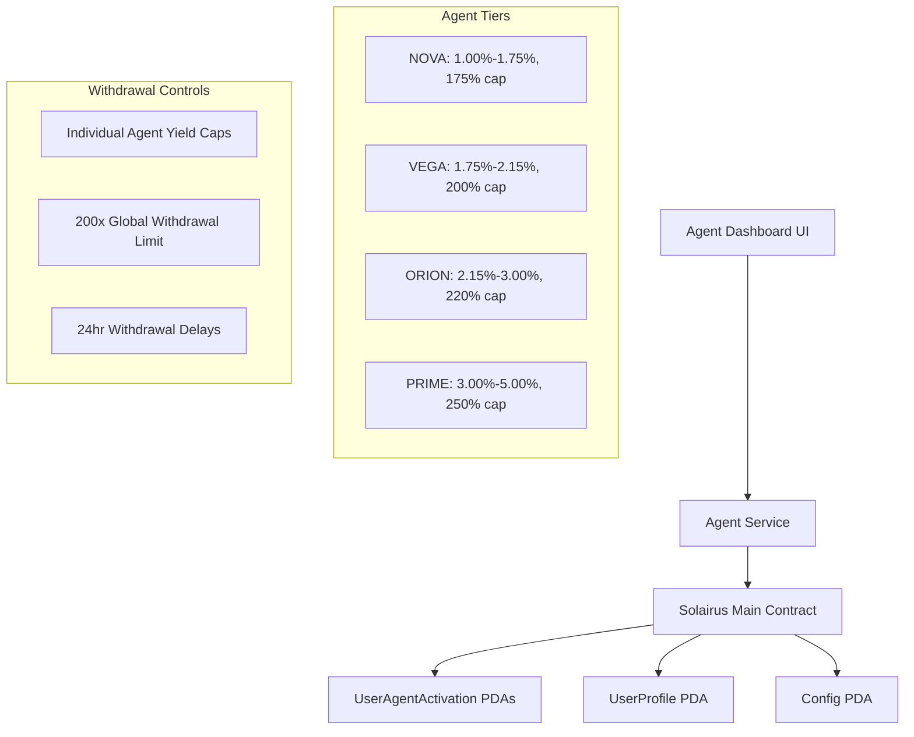

# Enhanced AI Agent System Design

## Overview

This design implements a comprehensive AI agent system that enhances the existing Solairus agent activation functionality with tier-based management, individual agent ROI tracking, yield caps, and withdrawal limits. The system builds upon the current `UserAgentActivation` and `UserProfile` structures while adding tier-specific logic, random ROI generation, and sophisticated withdrawal controls.

## Architecture

### System Components



### Data Flow

1. **Agent Activation**: User selects tier → Contract validates → Creates PDA → Updates counters
2. **ROI Withdrawal**: User requests → Contract validates timing/limits → Generates random ROI → Transfers USDT
3. **Dashboard Query**: UI queries → Service fetches PDAs → Displays agent portfolio

## Components and Interfaces

### Smart Contract Enhancements

#### Enhanced UserAgentActivation Structure
```rust
#[account]
pub struct UserAgentActivation {
    pub user: Pubkey,                    // User who activated the agent
    pub activation_id: u64,              // Unique ID per user
    pub tier: u8,                        // 0=NOVA, 1=VEGA, 2=ORION, 3=PRIME
    pub using_usdt: bool,                // Payment method (USDT vs Credit)
    pub amount_usdt: u64,                // Activation amount in USDT
    pub started_at: i64,                 // Activation timestamp
    pub last_roi_withdraw_at: i64,       // Last ROI withdrawal timestamp
    pub total_roi_withdrawn: u64,        // Total ROI withdrawn from this agent
    pub yield_cap_reached: bool,         // Whether agent has reached yield cap
    pub bump: u8,                        // PDA bump seed
}

impl UserAgentActivation {
    pub const SIZE: usize = 32 + 8 + 1 + 1 + 8 + 8 + 8 + 8 + 1 + 1; // 76 bytes
}
```

#### Enhanced UserProfile Structure
```rust
#[account]
pub struct UserProfile {
    // ... existing fields
    pub total_agent_deposits: u64,       // Total USDT spent on agent activations
    pub total_roi_withdrawn: u64,        // Total ROI withdrawn across all agents
    pub global_withdrawal_limit_reached: bool, // Whether 200x limit is reached
}
```

#### Agent Tier Configuration
```rust
pub struct AgentTierConfig {
    pub min_yield_bps: u16,              // Minimum daily yield (basis points)
    pub max_yield_bps: u16,              // Maximum daily yield (basis points)
    pub yield_cap_pct: u16,              // Total yield cap percentage
}

// Tier configurations (hardcoded in contract)
const TIER_CONFIGS: [AgentTierConfig; 4] = [
    AgentTierConfig { min_yield_bps: 100, max_yield_bps: 175, yield_cap_pct: 175 }, // NOVA
    AgentTierConfig { min_yield_bps: 175, max_yield_bps: 215, yield_cap_pct: 200 }, // VEGA
    AgentTierConfig { min_yield_bps: 215, max_yield_bps: 300, yield_cap_pct: 220 }, // ORION
    AgentTierConfig { min_yield_bps: 300, max_yield_bps: 500, yield_cap_pct: 250 }, // PRIME
];
```

### New Smart Contract Functions

#### Enhanced Agent Activation
```rust
pub fn activate_agent_usdt_with_tier(
    ctx: Context<ActivateAgentUsdtWithTier>, 
    amount: u64,
    tier: u8
) -> Result<()> {
    // Validate tier (0-3)
    require!(tier <= 3, ErrorCode::InvalidTier);
    
    // Existing activation logic...
    
    // Store tier in activation record
    ctx.accounts.activation.tier = tier;
    
    // Update user's total agent deposits for withdrawal limit tracking
    ctx.accounts.profile.total_agent_deposits = ctx.accounts.profile.total_agent_deposits
        .checked_add(amount)
        .ok_or(ErrorCode::MathOverflow)?;
    
    Ok(())
}
```

#### Individual Agent ROI Withdrawal
```rust
pub fn withdraw_agent_roi(
    ctx: Context<WithdrawAgentRoi>,
    activation_id: u64
) -> Result<()> {
    let activation = &mut ctx.accounts.activation;
    let profile = &mut ctx.accounts.profile;
    let config = &ctx.accounts.config;
    
    // Validate 24hr delay since activation
    let now = Clock::get()?.unix_timestamp;
    require!(
        now >= activation.started_at + 86_400,
        ErrorCode::WithdrawalTooEarly
    );
    
    // Validate 24hr delay since last withdrawal
    if activation.last_roi_withdraw_at > 0 {
        require!(
            now >= activation.last_roi_withdraw_at + 86_400,
            ErrorCode::WithdrawalTooEarly
        );
    }
    
    // Check if agent has reached yield cap
    require!(!activation.yield_cap_reached, ErrorCode::AgentRetired);
    
    // Check global withdrawal limit (200x deposits)
    let max_global_withdrawal = profile.total_agent_deposits
        .checked_mul(200)
        .ok_or(ErrorCode::MathOverflow)?;
    
    // Exempt privileged roles from global limit
    let is_privileged = is_privileged_user(&ctx.accounts.user.key(), config);
    
    if !is_privileged {
        require!(
            profile.total_roi_withdrawn < max_global_withdrawal,
            ErrorCode::GlobalWithdrawalLimitReached
        );
    }
    
    // Generate random ROI within tier range
    let roi_amount = calculate_random_roi(
        activation.tier,
        activation.amount_usdt,
        now as u64,
        &ctx.accounts.user.key(),
        activation_id
    )?;
    
    // Check individual agent yield cap
    let tier_config = &TIER_CONFIGS[activation.tier as usize];
    let max_total_yield = activation.amount_usdt
        .checked_mul(tier_config.yield_cap_pct as u64)
        .ok_or(ErrorCode::MathOverflow)?
        .checked_div(100)
        .ok_or(ErrorCode::MathOverflow)?;
    
    let new_total_withdrawn = activation.total_roi_withdrawn
        .checked_add(roi_amount)
        .ok_or(ErrorCode::MathOverflow)?;
    
    if new_total_withdrawn >= max_total_yield {
        // Agent reaches yield cap - mark as retired
        activation.yield_cap_reached = true;
        // Adjust ROI to exact yield cap amount
        let adjusted_roi = max_total_yield
            .checked_sub(activation.total_roi_withdrawn)
            .ok_or(ErrorCode::MathOverflow)?;
        
        if adjusted_roi == 0 {
            return Err(ErrorCode::AgentRetired.into());
        }
        
        roi_amount = adjusted_roi;
    }
    
    // Ensure global limit not exceeded
    if !is_privileged {
        let new_global_total = profile.total_roi_withdrawn
            .checked_add(roi_amount)
            .ok_or(ErrorCode::MathOverflow)?;
        
        if new_global_total > max_global_withdrawal {
            return Err(ErrorCode::GlobalWithdrawalLimitReached.into());
        }
    }
    
    // Transfer USDT from system reserve to user
    require!(config.bucket_systemreserve_usdt >= roi_amount, ErrorCode::InsufficientFunds);
    
    let decimals = ctx.accounts.usdt_mint.decimals;
    let cpi_accounts = TransferChecked {
        from: ctx.accounts.vault_usdt.to_account_info(),
        to: ctx.accounts.user_usdt.to_account_info(),
        mint: ctx.accounts.usdt_mint.to_account_info(),
        authority: ctx.accounts.vault.to_account_info(),
    };
    let vault_bump = ctx.accounts.vault.bump;
    let seeds: &[&[u8]] = &[b"vault", &[vault_bump]];
    let signer_seeds: &[&[&[u8]]] = &[seeds];
    let cpi_ctx = CpiContext::new_with_signer(
        ctx.accounts.token_program.to_account_info(), 
        cpi_accounts, 
        signer_seeds
    );
    token::transfer_checked(cpi_ctx, roi_amount, decimals)?;
    
    // Update state
    config.bucket_systemreserve_usdt = config.bucket_systemreserve_usdt
        .checked_sub(roi_amount)
        .ok_or(ErrorCode::MathOverflow)?;
    
    activation.total_roi_withdrawn = new_total_withdrawn;
    activation.last_roi_withdraw_at = now;
    
    profile.total_roi_withdrawn = profile.total_roi_withdrawn
        .checked_add(roi_amount)
        .ok_or(ErrorCode::MathOverflow)?;
    
    // Emit event
    emit!(AgentRoiWithdrawalEvent {
        user: ctx.accounts.user.key(),
        activation_id,
        tier: activation.tier,
        roi_amount,
        agent_total_withdrawn: activation.total_roi_withdrawn,
        agent_yield_cap_reached: activation.yield_cap_reached,
        user_total_withdrawn: profile.total_roi_withdrawn,
        timestamp: now,
    });
    
    Ok(())
}
```

#### Random ROI Calculation Function
```rust
fn calculate_random_roi(
    tier: u8,
    principal: u64,
    current_slot: u64,
    user_pubkey: &Pubkey,
    activation_id: u64,
) -> Result<u64> {
    // Create deterministic but unpredictable seed
    let mut seed_data = Vec::new();
    seed_data.extend_from_slice(&current_slot.to_le_bytes());
    seed_data.extend_from_slice(user_pubkey.as_ref());
    seed_data.extend_from_slice(&activation_id.to_le_bytes());
    
    // Hash for randomness
    let hash = solana_program::hash::hash(&seed_data);
    let random_value = u64::from_le_bytes([
        hash.as_ref()[0], hash.as_ref()[1], hash.as_ref()[2], hash.as_ref()[3],
        hash.as_ref()[4], hash.as_ref()[5], hash.as_ref()[6], hash.as_ref()[7],
    ]);
    
    // Get tier configuration
    let tier_config = &TIER_CONFIGS[tier as usize];
    let min_bps = tier_config.min_yield_bps;
    let max_bps = tier_config.max_yield_bps;
    
    // Generate random ROI within range
    let range = max_bps - min_bps;
    let random_bps = min_bps + (random_value % range as u64) as u16;
    
    // Calculate ROI amount
    let roi_amount = principal
        .checked_mul(random_bps as u64)
        .ok_or(ErrorCode::MathOverflow)?
        .checked_div(10_000)
        .ok_or(ErrorCode::MathOverflow)?;
    
    Ok(roi_amount)
}
```

### Frontend Components

#### Agent Dashboard Component
```typescript
interface AgentDashboardProps {
  userPublicKey: PublicKey;
}

interface AgentData {
  activationId: number;
  tier: AgentTier;
  activationAmount: number;
  activatedAt: Date;
  lastRoiWithdrawal: Date | null;
  totalRoiWithdrawn: number;
  yieldCapReached: boolean;
  canWithdraw: boolean;
  nextWithdrawalAt: Date | null;
}

export const AgentDashboard: React.FC<AgentDashboardProps> = ({ userPublicKey }) => {
  const [agents, setAgents] = useState<AgentData[]>([]);
  const [withdrawalLimitStatus, setWithdrawalLimitStatus] = useState<WithdrawalLimitStatus>();
  
  // Query all user's agents
  const fetchUserAgents = async () => {
    const agentAccounts = await connection.getProgramAccounts(PROGRAM_ID, {
      filters: [
        { dataSize: 8 + UserAgentActivation.SIZE },
        { memcmp: { offset: 8, bytes: userPublicKey.toBase58() } }
      ]
    });
    
    // Process and set agents data
  };
  
  // Individual agent ROI withdrawal
  const withdrawAgentRoi = async (activationId: number) => {
    // Call withdraw_agent_roi instruction
  };
  
  return (
    <div className="agent-dashboard">
      <WithdrawalLimitDisplay status={withdrawalLimitStatus} />
      <AgentGrid agents={agents} onWithdraw={withdrawAgentRoi} />
    </div>
  );
};
```

#### Agent Tier Selection Component
```typescript
interface TierSelectionProps {
  onTierSelect: (tier: AgentTier) => void;
  selectedTier?: AgentTier;
}

const TIER_INFO = {
  NOVA: { 
    name: 'NOVA', 
    emoji: '🪶', 
    dailyRange: '1.00% - 1.75%', 
    yieldCap: '175%',
    description: 'Entry-level agent, safe and steady'
  },
  VEGA: { 
    name: 'VEGA', 
    emoji: '🔮', 
    dailyRange: '1.75% - 2.15%', 
    yieldCap: '200%',
    description: 'Balanced risk and return'
  },
  ORION: { 
    name: 'ORION', 
    emoji: '⚡', 
    dailyRange: '2.15% - 3.00%', 
    yieldCap: '220%',
    description: 'Aggressive but controlled'
  },
  PRIME: { 
    name: 'PRIME', 
    emoji: '🧠', 
    dailyRange: '3.00% - 5.00%', 
    yieldCap: '250%',
    description: 'Elite trading AI'
  }
};

export const TierSelection: React.FC<TierSelectionProps> = ({ onTierSelect, selectedTier }) => {
  return (
    <div className="tier-selection-grid">
      {Object.entries(TIER_INFO).map(([tier, info]) => (
        <TierCard 
          key={tier}
          tier={tier as AgentTier}
          info={info}
          selected={selectedTier === tier}
          onSelect={onTierSelect}
        />
      ))}
    </div>
  );
};
```

## Data Models

### Agent Tier Enum
```typescript
export enum AgentTier {
  NOVA = 0,
  VEGA = 1,
  ORION = 2,
  PRIME = 3
}

export interface AgentTierConfig {
  minYieldBps: number;
  maxYieldBps: number;
  yieldCapPct: number;
  name: string;
  emoji: string;
  description: string;
}
```

### Withdrawal Limit Status
```typescript
export interface WithdrawalLimitStatus {
  totalDeposits: number;
  totalWithdrawn: number;
  maxWithdrawable: number;
  remainingWithdrawable: number;
  limitReached: boolean;
  isPrivileged: boolean;
}
```

## Error Handling

### New Error Codes
```rust
#[error_code]
pub enum ErrorCode {
    // ... existing errors
    #[msg("Invalid agent tier")]
    InvalidTier,
    #[msg("Agent has reached yield cap and is retired")]
    AgentRetired,
    #[msg("Withdrawal too early - 24 hour cooldown required")]
    WithdrawalTooEarly,
    #[msg("Global withdrawal limit reached (200x deposits)")]
    GlobalWithdrawalLimitReached,
    #[msg("Agent not found")]
    AgentNotFound,
    #[msg("Insufficient system reserve funds")]
    InsufficientSystemReserve,
}
```

### Error Handling Strategy
- **Validation Errors**: Clear user messages with specific requirements
- **Timing Errors**: Display countdown timers for withdrawal availability
- **Limit Errors**: Show current status and remaining limits
- **System Errors**: Graceful fallbacks with retry mechanisms

## Testing Strategy

### Unit Tests
- Agent tier configuration validation
- Random ROI generation within ranges
- Yield cap calculations and enforcement
- Global withdrawal limit tracking
- 24-hour delay validations

### Integration Tests
- Complete agent activation flow with tier selection
- Individual agent ROI withdrawal process
- Multi-agent portfolio management
- Withdrawal limit enforcement across multiple agents
- Privileged user exemption testing

### End-to-End Tests
- User activates agents of different tiers
- Daily ROI withdrawals over time
- Agent retirement when yield cap reached
- Global limit enforcement and recovery
- Dashboard displays accurate agent status

## Security Considerations

### Access Control
- Only agent owner can withdraw ROI from their agents
- Privileged roles exempt from global limits but not yield caps
- PDA seeds ensure unique agent records per user

### Economic Security
- Yield caps prevent infinite ROI extraction
- Global limits ensure system sustainability
- Random ROI prevents gaming/prediction
- System reserve validation prevents overdrafts

### Data Integrity
- Immutable agent activation records
- Atomic state updates for withdrawals
- Overflow protection in all calculations
- Event emission for audit trails