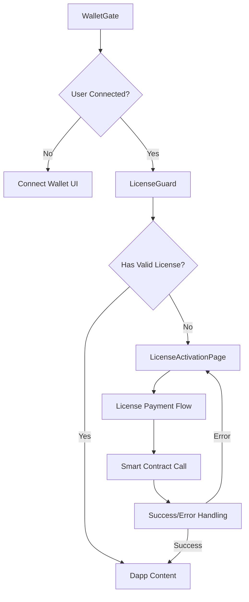

# Design Document

## Overview

The license activation guard system provides a seamless user experience for managing yearly license access to the Solairus platform. The system integrates with the solairus_main smart contract to handle USDT-based license payments and validates user access through UserProfile data. The design follows the established dApp UI patterns and provides a mobile-first experience within the 390px container layout.

## Architecture

### Smart Contract Integration

The system leverages the solairus_main contract with the following key components:

- **activate_license_usdt instruction**: Handles USDT payment for license activation
- **Config account**: Stores license fee configuration and distribution percentages
- **UserProfile account**: Tracks user registration and license status
- **Vault system**: Manages USDT token transfers and affiliate distributions

### License Status Determination

The system will use on-chain license expiration tracking for reliable and secure validation:

1. **User Registration Check**: Verify if UserProfile exists for the connected wallet
2. **License Expiration Check**: Read license_expires_at field from UserProfile
3. **Current Time Validation**: Compare on-chain timestamp with current blockchain time
4. **Fallback Logic**: If UserProfile doesn't exist or license_expires_at is 0/null, user needs activation

**Required Smart Contract Modifications**:
- Add `license_expires_at: i64` field to UserProfile struct
- Update `activate_license_usdt` instruction to set expiration timestamp (current_time + 365 days)
- Add `license_duration_days: u16` field to Config for configurable license duration

### Component Architecture



## Components and Interfaces

### 1. LicenseGuard Component

**Purpose**: Higher-order component that wraps dApp routes to enforce license validation

**Props**:
```typescript
interface LicenseGuardProps {
  children: ReactNode;
}
```

**Key Methods**:
- `checkLicenseStatus()`: Validates current user license
- `redirectToActivation()`: Redirects to license activation page
- `handleLicenseExpiry()`: Manages near-expiry notifications

### 2. LicenseActivationPage Component

**Purpose**: Dedicated page for license activation with payment flow

**Key Features**:
- Welcome message with Solairus branding
- License fee display from smart contract config
- USDT payment button with transaction handling
- Success state with countdown display
- Error handling with retry mechanisms

### 3. LicenseStatusCard Component

**Purpose**: Reusable card component for displaying license information

**Props**:
```typescript
interface LicenseStatusCardProps {
  status: 'active' | 'expired' | 'near-expiry' | 'none';
  expirationDate?: Date;
  onActivate?: () => void;
}
```

### 4. CountdownTimer Component

**Purpose**: Real-time countdown display for license expiration

**Props**:
```typescript
interface CountdownTimerProps {
  targetDate: Date;
  onExpiry?: () => void;
}
```

### 5. Smart Contract Service

**Purpose**: Abstraction layer for solairus_main contract interactions

**Key Methods**:
```typescript
interface LicenseService {
  checkUserProfile(userPubkey: PublicKey): Promise<UserProfile | null>;
  getConfig(): Promise<Config>;
  activateLicense(amount: number): Promise<string>;
  isLicenseActive(userProfile: UserProfile): boolean;
  getLicenseExpiryDate(userProfile: UserProfile): Date;
}
```

## Data Models

### License Status Types

```typescript
type LicenseStatus = 'active' | 'expired' | 'near-expiry' | 'none' | 'loading';

interface LicenseInfo {
  status: LicenseStatus;
  expirationDate?: Date;
  daysRemaining?: number;
  isValid: boolean;
}
```

### Smart Contract Data Types

```typescript
interface UserProfile {
  user: PublicKey;
  sponsor_l1: PublicKey;
  sponsor_l2: PublicKey;
  sponsor_l3: PublicKey;
  created_at: number; // i64 timestamp
  active_principal_usdt: number; // u64
  last_roi_withdraw_at: number; // i64
  license_expires_at: number; // i64 timestamp - NEW FIELD
}

interface Config {
  activation_fee_usdt: number; // u64 - license fee amount
  usdt_mint: PublicKey;
  license_duration_days: number; // u16 - NEW FIELD (default 365)
  license_admin_pct: number; // u16
  license_dev_pct: number; // u16
  // ... other percentage fields
}
```

## Error Handling

### Transaction Errors

1. **Insufficient USDT Balance**: Display clear message with USDT acquisition guidance
2. **Network Errors**: Retry mechanism with exponential backoff
3. **Smart Contract Errors**: Parse Anchor error codes for user-friendly messages
4. **Wallet Rejection**: Handle user cancellation gracefully

### Loading States

1. **License Status Check**: Skeleton loading for license cards
2. **Transaction Processing**: Progress indicator with transaction hash
3. **Smart Contract Data**: Loading states for config and profile fetching

### Error Recovery

- Automatic retry for network failures
- Manual retry buttons for user-initiated actions
- Fallback to cached data when appropriate
- Clear error messages with actionable next steps

## Testing Strategy

### Unit Tests

1. **LicenseGuard Logic**: Test license validation scenarios
2. **Smart Contract Service**: Mock contract interactions
3. **Component Rendering**: Test different license states
4. **Countdown Timer**: Test time calculations and updates

### Integration Tests

1. **License Activation Flow**: End-to-end payment process
2. **Route Protection**: Test guard behavior across routes
3. **Wallet Integration**: Test with different wallet states
4. **Error Scenarios**: Test network failures and recoveries

### E2E Tests

1. **Complete License Flow**: From connection to activation
2. **Expiry Handling**: Test near-expiry and expired states
3. **Multi-device**: Test responsive behavior
4. **Performance**: Test loading times and responsiveness

## UI/UX Design Patterns

### Consistent Styling

- Follow existing card-based layout patterns
- Use established color scheme and typography
- Maintain 390px mobile container constraints
- Integrate with TopBar and BottomNav components

### User Flow Optimization

1. **Progressive Disclosure**: Show relevant information at each step
2. **Clear CTAs**: Prominent activation buttons with clear pricing
3. **Status Feedback**: Real-time updates during transactions
4. **Error Prevention**: Validate inputs before submission

### Accessibility

- ARIA labels for screen readers
- Keyboard navigation support
- High contrast mode compatibility
- Focus management for modal states

## Performance Considerations

### Smart Contract Optimization

- Cache config data to reduce RPC calls
- Batch multiple account fetches when possible
- Use connection pooling for reliability
- Implement request deduplication

### UI Performance

- Lazy load license activation page
- Optimize countdown timer updates
- Use React.memo for expensive components
- Implement proper cleanup for timers

### Data Management

- Local storage for license status caching
- Reactive updates when license status changes
- Efficient re-validation strategies
- Background refresh for near-expiry users
## Smart 
Contract Upgrade Requirements

### Required Changes to solairus_main Contract

#### 1. UserProfile Struct Modification

Add license expiration tracking to the UserProfile account:

```rust
#[account]
pub struct UserProfile {
    pub user: Pubkey,
    pub sponsor_l1: Pubkey,
    pub sponsor_l2: Pubkey,
    pub sponsor_l3: Pubkey,
    pub created_at: i64,
    pub active_principal_usdt: u64,
    pub last_roi_withdraw_at: i64,
    pub license_expires_at: i64, // NEW: License expiration timestamp
}
```

#### 2. Config Struct Modification

Add configurable license duration to the Config account:

```rust
#[account]
pub struct Config {
    // ... existing fields
    pub license_duration_days: u16, // NEW: Configurable license duration (default 365)
    // ... rest of existing fields
}
```

#### 3. activate_license_usdt Instruction Update

Modify the instruction to set license expiration:

```rust
pub fn activate_license_usdt(ctx: Context<ActivateLicenseUsdt>, amount: u64) -> Result<()> {
    // ... existing payment logic
    
    // NEW: Set license expiration
    let clock = Clock::get()?;
    let config = &ctx.accounts.config;
    let license_duration_seconds = (config.license_duration_days as i64) * 24 * 60 * 60;
    
    ctx.accounts.profile.license_expires_at = clock.unix_timestamp + license_duration_seconds;
    
    // ... rest of existing logic
}
```

#### 4. License Validation Helper

Add a helper function for license validation:

```rust
impl UserProfile {
    pub fn has_active_license(&self) -> Result<bool> {
        let clock = Clock::get()?;
        Ok(self.license_expires_at > clock.unix_timestamp)
    }
}
```

### Migration Strategy

1. **Backward Compatibility**: Existing UserProfile accounts will have `license_expires_at = 0`
2. **Migration Logic**: Add migration instruction to set expiration for existing users based on `created_at + 365 days`
3. **Gradual Rollout**: Deploy contract update first, then update frontend to use new fields
4. **Fallback Logic**: Frontend should handle both old (calculated) and new (on-chain) expiration methods during transition